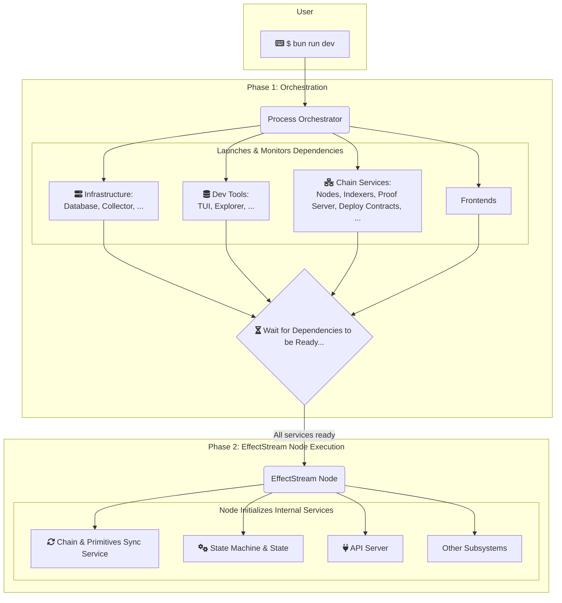

# Quick Start

> Linux and macOS are supported. Windows WSL is experimental.

> This is a preview of the EffectStream V2 documentation. We welcome any feedback you have on errors, missing information, or parts that aren't clear.

Install [Bun](https://bun.sh), [Foundry](https://www.getfoundry.sh/), and the
EVM/Midnight template's selected Compact compiler (`0.33.0-rc.2`) before
starting:

```sh
curl -L https://foundry.paradigm.xyz | bash && foundryup
curl --proto '=https' --tlsv1.2 -LsSf https://github.com/midnightntwrk/compact/releases/latest/download/compact-installer.sh | sh
```

First, clone the repository and use the `templates/evm-midnight-v2/` folder as a working template:

```sh
git clone https://github.com/effectstream/effectstream.git
cd effectstream/templates/evm-midnight-v2

# Install the checksummed Compact selection declared by this template
bun toolchain/compact.ts install

# Install packages
bun i

# Launch EffectStream Node (compiles contracts and starts the full local stack)
bun run dev
```

Now you should see the dApp running in your browser!

### Terminal

<iframe src="https://drive.google.com/file/d/1vLHmm9HrPrKiIHJlnnX3aopeX0J-A9Oz/preview" width="640" height="480" allow="autoplay"></iframe>

### Browser

<iframe src="https://drive.google.com/file/d/1hDh5PkKQdDx8UXnBsS1clypvXF14Msvm/preview" width="640" height="480" allow="autoplay"></iframe>

Once you have the template up and running, there are different parts you can modify or extend.

- **State Machine**: Logic and rules for events.
- **Front End**: User side App.
- **Chain Config**: Connect different chains.
- **Process Orchestrator**: Decide what processes to start and run for development.
- **Contracts & EffectStream-L2**: Deploy and connect different contracts.
- **Grammar**: Define EffectStream-L2 Contract valid Inputs

More [Components](../100-components/100-components.md)

## Packages & Folder Structure

> We will be using `/templates/evm-midnight-v2/` as example for the following definitions.

Default folder structure:

```
|-- package.json                     # workspace definition
|-- packages
     |-- database                    # database queries and tables
     |-- node                        # node startup, api, and state machine
     |-- frontend                    # web app
     |-- batcher                     # batcher service
     |-- contracts-evm               # hardhat & evm contracts
     |-- contracts-midnight          # midnight contracts
     |-- tests                       # integration tests
```

Workspace packages:

```
packages/database          @evm-midnight/database
packages/node              @evm-midnight/node
packages/frontend          @evm-midnight/frontend
packages/batcher           @evm-midnight/batcher
packages/contracts-evm     @evm-midnight/contracts-evm
packages/contracts-midnight @evm-midnight/contracts-midnight
packages/tests             @evm-midnight/tests
```

## Startup Overview

The EffectStream Startup sequence:



The `start(...)` function launches the node. It's located in `packages/node/main.dev.ts` (and `main.mainnet.ts` for production), and receives as inputs the node configuration.

```ts
main(function* () {
  yield* init();

  yield* withEffectstreamStaticConfig(localhostConfig, function* () {
    yield* start({
      appName: "My-dApp",
      appVersion: "1.0.0",
      syncInfo: toSyncProtocolWithNetwork(localhostConfig),
      gameStateTransitions,
      migrations,
      apiRouter,
      grammar,
    });
  });

  yield* suspend();
});
```

Learn more about the [Node Startup](../100-components/117-node-startup.md)

## State Machine

A State Machine (SM) is the core of your EffectStream application, defining its logic and rules. Let's break down the concept:

1. It has a State, which is the complete record of the EffectStream Node at any given moment (e.g., user assets, statuses, etc.), stored in a database.
2. The SM is defined by a series of State Transition Functions (STFs). These are the functions that change the State in response to an Input.
3. The Inputs are blockchain events that your application is configured to monitor. The STFs process these on-chain events and transform them into updates for your application's state.
4. The SM is deterministic, meaning multiple instances of a EffectStream Node processing the same inputs in the same order will always generate the exact same final State.
5. The entire process runs within the EffectStream Node.

```
                     State Machine
Block Chain -> STF-1 (e.g., handle mint)    -> Application Data
Events         STF-2 (e.g., handle transfer)   (database)
               STF-N (...)
```

Let's start with a practical example where calls to a `EffectStream L2` contract are converted into actions.

For example, this STF:

```ts
stm.addStateTransition("create", function* (data) {
  const { game_id } = data.parsedInput.payload;
  yield* World.resolve(create_game, {
    game_id: game_id,
    block_height: data.blockHeight,
  });
  return;
});
```

If the contract [EffectStream L2 Event](../100-components/104-l2-contract.md) function `effectstreamSubmitGameInput` is called with payload `["create", "0x1234"]`, this creates a row in your `games` table, with id = `0x1234`

Now your application can read the database and use the created "game" from the table.

More about the [State Machine](../100-components/102-state-machine.md)

## Frontend (dApp)

The frontend is your user-facing application, such as a web game or a dashboard.
The `/templates/evm-midnight-v2/` comes with a folder called `/packages/frontend/` with an example Web App. It interacts with EffectStream in two primary ways:

### Writes (Sending Actions)

> EffectStream web application, games or other frontend require to write to the Blockchain to interact with EffectStream.

- **Direct Contract Interaction**. E.g., Call `transfer` on a `ERC20` contract. Wallets can be integrated to make these calls.
- **Direct EffectStream L2 Contract Interaction**: `Submit Input` method. This allows to pass a custom message to the engine. Wallets can be integrated to make these calls.
- **Batcher Interaction**: Interact with your contracts, but through a HTTP calls. This custom built service can convert and validate the calls and writes to the Contract.

### Reads

- **Reads from Blockchain** Some blockchains expose APIs you can read to get the state or other information. We do not recommend doing this unless strictly necessary.
- **Reads from EffectStream API** EffectStream Provides son Endpoints you can consume.
- **Reads from Custom API** You can create your own custom endpoints.

More about the [Frontend](../100-components/115-frontend.md)
More about the [API](../100-components/103-api.md)

## Chain Config & Sync Service

The Sync Service is the bridge between the blockchain world and your application's logic. You configure this service using the `ConfigBuilder` to define **Primitives**. A primitive is a specific listener for on-chain events, such as a token transfer or an interaction with your [EffectStream L2 contract](../100-components/104-l2-contract.md).

When a primitive detects an event, it uses a `stateMachinePrefix` to trigger the corresponding State Transition Function (STF) in your [state machine](../100-components/102-state-machine.md). This setup allows your application to react to events from multiple chains in a deterministic way.

:::warning
Use `stateMachinePrefix`, not the deprecated `scheduledPrefix`. The runtime reads `stateMachinePrefix` when constructing the primitive; a primitive configured with only `scheduledPrefix` still writes accounting rows but **never delivers an input to the state machine**, and it fails silently — no error, just STFs that never fire.
:::

A example minimal configuration looks like this:

```ts
import { PrimitiveTypeEVMERC721 } from "@effectstream/sm/builtin";

export const localhostConfig = new ConfigBuilder()
  // Define which chains to connect to
  .buildNetworks(builder =>
    .addNetwork({
          name: "ntp",
          type: ConfigNetworkType.NTP
          startTime: launchStartTime ?? new Date().getTime(),
          blockTimeMS: 1000,
    })
    .addViemNetwork({ name: "evmchain", ...hardhat })
    .addNetwork({
        name: "midnight",
        type: ConfigNetworkType.MIDNIGHT,
        /* other fields */
     })
  // Define how to sync from those chains
  .buildSyncProtocols(builder =>
    builder.addMain(/*...main protocol config...*/)
    builder.addParallel(/* evm */)
    builder.addParallel(/* midnightr */)
  )
  // Define what specific events to listen for
  .buildPrimitives(builder =>
    builder.addPrimitive(
        (syncProtocols) => syncProtocols.evmchain,
        (network, deployments, syncProtocol) => ({
          name: "Track-ERC721",
          type: PrimitiveTypeEVMERC721,
          contractAddress: "0x...",
          abi: getEvmEvent(erc722.abi, "Transfer(...)"),
          // This prefix triggers the 'transfer-assets' STF
          stateMachinePrefix: "transfer-assets",
        })
    )
  )
  .build();
```

This configuration tells the engine to watch an ERC721 contract for `Transfer` events and trigger the `transfer-assets` function in your state machine whenever one occurs.

Learn more about the [Sync Service & Chain Config](../100-components/101-sync-service.md).

## Contracts

EffectStream can monitor any smart contract on a supported chain by listening to the **events** it emits. For example, you can deploy a standard ERC20 contract, and the engine can track its `Transfer` events to update balances in your application's state.

```solidity
// A standard ERC20 contract EffectStream can listen to
contract Erc20Dev is ERC20 {
    constructor() ERC20("Mock ERC20", "MERC") {}
    function mint(address _to, uint256 _amount) external {
        _mint(_to, _amount); // This emits the Transfer event
    }
}
```

While any contract works, EffectStream provides the specialized **`EffectstreamL2Contract`**, which acts as a highly efficient "mailbox" for your game. Instead of deploying complex on-chain logic, you send simple, formatted strings (e.g., `["attack","p1", "m7"]`) to its `effectstreamSubmitGameInput` function. This saves gas, increases flexibility, and enables the **Batcher** for a cross-chain, gasless user experience.

You connect a contract event to your State Machine by defining a **Primitive** in your chain configuration, which links the event to a `stateMachinePrefix` that triggers your game logic.

Learn more about [Contracts](../100-components/105-contracts.md)
More about [EffectStream L2](../100-components/104-l2-contract.md)

## Process Orchestrator

Developing a multi-chain dApp requires running many services at once. The **Process Orchestrator** is a powerful tool that automates your entire local development setup.

When you run `bun run dev`, the orchestrator defined in the `start.dev.ts` file at the `/templates/evm-midnight-v2/` example launches your complete environment in the correct order.

This includes:

- Starting local blockchains (EVM, Midnight, etc.).
- Deploying your smart contracts.
- Running essential services like a development database and the Batcher.

By handling all this infrastructure automatically, the orchestrator makes local development a simple, one-command process. Once the environment is ready, it starts the main **EffectStream Sync Service**, which begins syncing data and running your state machine.

```ts
// start.dev.ts
import path from "node:path";
import type { OrchestratorConfig } from "@effectstream/orchestrator/config";
import { launchPglite, DbNames } from "@effectstream/orchestrator/launch-pglite";
import { launchEvm, EvmNames } from "@effectstream/orchestrator/launch-evm";
import { launchMidnight, MidnightNames } from "@effectstream/orchestrator/launch-midnight";

const root = import.meta.dirname!;

export default {
  processes: [
    // Development database
    ...launchPglite(),
    // Local chains, contract deploys and generated bindings
    ...launchEvm("@evm-midnight/contracts-evm", {
      cwd: path.join(root, "packages/contracts-evm"),
    }),
    ...launchMidnight("@evm-midnight/contracts-midnight", {
      cwd: path.join(root, "packages/contracts-midnight"),
    }),
    // The sync engine, once everything it needs is ready
    {
      name: "sync",
      args: ["run", "packages/node/main.dev.ts"],
      env: { PGLITE: "true" },
      dependsOn: [
        DbNames.PGLITE_WAIT,
        EvmNames.GENERATE_MOD,
        MidnightNames.CONTRACT_DEPLOY,
      ],
    },
  ],
} satisfies OrchestratorConfig;
```

More about [Processes Orchestrator](../100-components/106-processes.md)

## Grammar

The Grammar is the language of your dApp, connecting on-chain inputs to your State Machine. EffectStream uses a structured **JSON array format** for all inputs, like `["attack", 1, 42]`.

The first element (`"attack"`) is the **prefix**. It acts as a command that the engine uses to route the input to the correct State Transition Function (STF). You define these rules in a `grammar.ts` file, specifying the name and data type for each argument. This provides automatic validation and type-safety for all user actions.

Example grammar definition:

```ts
export const grammar = {
  attack: [
    ["playerId", Type.Integer()],
    ["moveId", Type.Integer()],
  ],
  // Add one entry per on-chain event you want to route to an STF.
} as const satisfies GrammarDefinition;
```

More about [Grammar](../100-components/111-grammar.md)

## Next Steps: Dive Deeper into EffectStream

Congratulations! You've successfully set up a EffectStream project and have a foundational understanding of its core components. You've seen how the **Orchestrator** sets up your environment, how the **Sync Service** and **Grammar** process on-chain data, and how the **State Machine** executes your application's logic.

Now you're ready to explore the full power and flexibility of the engine. Use the following sections as a guide to dive deeper into the topics that interest you most.

### Core Components Deep Dive

You've touched on the basics, now master the details of the components you've already used:

- [State Machine](../100-components/102-state-machine.md): Learn advanced techniques for managing your dApp's logic.
- [Sync Service & Chain Config](../100-components/101-sync-service.md): Uncover the full potential of multi-chain data aggregation.
- [Contracts & The EffectStream L2 Contract](../100-components/105-contracts.md): Explore the specifics of the `EffectStream L2Contract` and other provided contracts.
- [Grammar](../100-components/111-grammar.md): Master the language of your dApp for complex interactions.
- [Frontend (dApp)](../100-components/115-frontend.md): Discover best practices for building user interfaces.

### Advanced Features & Services

Level up your application with EffectStream's powerful, built-in services:

- [**Batcher**](../100-components/108-batcher/1200-overview.md): Offer a gasless, cross-chain experience to your users.
- [**Accounts**](../100-components/116-accounts.md): Implement a flexible L2 account system that goes beyond simple wallets.
- [**Randomness**](../100-components/113-randomness.md): Learn how to use EffectStream's deterministic randomness for fair and replayable game mechanics.
- [**Database**](../100-components/109-database.md): Take full control of your application's data with custom tables and queries.
- [**Achievements**](../100-components/114-achievements.md): Integrate a standardized achievement system into your dApp.

### Multi-Chain Development

EffectStream is a multi-chain engine at its core. Learn how to connect to and leverage the unique capabilities of different blockchains:

- [EVM Chains (Ethereum, Arbitrum, etc.)](../200-chains/201-evm.md)
- [Midnight (Zero-Knowledge)](../200-chains/202-midnight.md)
- [Cardano](../200-chains/203-cardano.md)
- [Avail (Data Availability)](../200-chains/204-avail.md)

### Deployment and Lifecycle

Ready to go live? These guides cover the final steps in your development journey:

- [Deploying Your Game to Production](../300-deployment/301-deploy-game.md)
- [Versioning and Upgrading Your dApp](../300-deployment/302-versioning.md)

### Standards and Interoperability (PRCs)

Paima Request for Comments (PRCs) are open standards that enable interoperability between dApps in the EffectStream ecosystem. Implementing these standards can enhance composability and user engagement.

- **PRC-1**: A standard for in-game achievements.
- **PRC-2**: The "Hololocker" for projecting L1 NFTs into your dApp without bridging.
- **PRC-3 & PRC-5**: "Inverse Projection" standards for representing in-game assets as tradable NFTs and tokens on major L1s.

### See it all in Action: The Tarochi Example

To see how all these components come together to build a complete, complex, and successful on-chain game, dive into our comprehensive tutorial based on a real-world example.

- [**Building Tarochi with EffectStream**](../1200-templates/1250-example-tarochi.md)

### Contributing to EffectStream

For advanced developers interested in the engine's internals or looking to contribute:

- [EffectStream Packages (NPM)](../1000-effectstream-engine/1000-effectstream-engine.md)
- [How to Contribute](../1000-effectstream-engine/1100-contributions.md)
