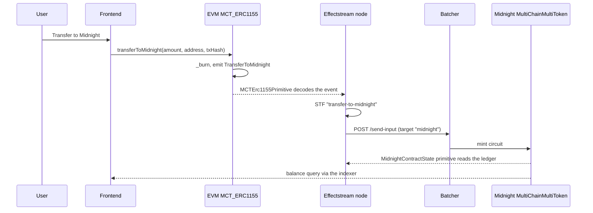

<!-- Generated from templates/multi-chain-token-transfer/README.md by docs/site/scripts/sync-template-readmes.ts. Do not edit directly. -->

> Template: **[`templates/multi-chain-token-transfer`](https://github.com/effectstream/effectstream/tree/main/templates/multi-chain-token-transfer)**

A token exists on two chains at once. On the EVM side it is an OpenZeppelin `ERC1155`; on
Midnight it is a Compact contract built on OpenZeppelin's `MultiToken`. Burning on one side
emits a public signal, the sync node picks it up, and the state machine tells a batcher to
mint the matching amount on the other side. The database keeps a single balance table that
both chains write into, so the API can answer "how much does this account own" without the
caller knowing which chain the tokens are currently sitting on.

The reason to read this template is not the swap — it is the **custom primitive**. Every
other template in this repository consumes primitives that ship with the framework. This
one implements its own, and it is the example the
[primitives documentation](https://effectstream.github.io/docs/home/components/primitives)
points at. If you have a contract whose events the built-in primitives do not model, this
is the file to copy.


## What this template shows

A primitive is the adapter between a sync protocol and the state machine: it declares what
to watch, and it turns raw chain data into a typed input. `MCTErc1155Primitive` in
[`packages/shared/custom-primitive-mct-erc1155/erc1155-primitive.ts`](https://github.com/effectstream/effectstream/blob/main/templates/multi-chain-token-transfer/packages/shared/custom-primitive-mct-erc1155/erc1155-primitive.ts)
is a complete, minimal implementation of one.

**It is a class, parameterised by a sync protocol and a grammar.** The base class is
`PaimaPrimitive` from `@paimaexample/sm`. The first type parameter fixes which sync
protocol feeds it — here `ConfigSyncProtocolType.EVM_RPC_PARALLEL`, which is what makes
`getPayload` receive EVM log data. The second is the grammar its output must satisfy.

```ts
const PrimitiveTypeEVMMCTERC1155 = "EVM:MCT_ERC1155" as const;

export class MCTErc1155Primitive extends PaimaPrimitive<
  ConfigSyncProtocolType.EVM_RPC_PARALLEL,
  typeof mctErc1155Grammar
> {
  readonly internalTypeName = PrimitiveTypeEVMMCTERC1155;
  readonly abi = getEvmEvent(mct_erc1155.abi, "TransferToMidnight(address,string,uint256,uint256,string)");
  override grammar = mctErc1155Grammar;
  readonly contractAddress: EvmAddress;
```

`internalTypeName` is the string used to select this primitive from configuration.
`abi` narrows the contract ABI down to the single event this primitive cares about — the
sync service subscribes to exactly that signature, nothing else.

**`getConfig()` hands the sync service its subscription.** The primitive owns the shape of
its own configuration entry; the return type is keyed off the same sync protocol type, so
the compiler rejects a config that the EVM parallel sync protocol could not act on.

```ts
override getConfig(): ProtocolPrimitiveMap[
  ConfigSyncProtocolType.EVM_RPC_PARALLEL
] {
  return {
    name: this.instanceName,
    type: this.internalTypeName,
    startBlockHeight: this.startBlockHeight,
    contractAddress: this.contractAddress as EvmAddress,
    abi: this.abi,
    scheduledPrefix: this.stateMachinePrefix ?? "",
  } as const;
}
```

**`getPayload()` is where the work happens**, and it returns *two* payloads per event. It
is a generator (a `StateUpdateStream`), so it can read from the database or await other
operations while decoding. Every field is decoded through a TypeBox helper rather than
cast, which is what keeps the parsed values deterministic across replays:

```ts
const { from, midnight_address, amount, token_id, tx_hash } = primitiveTransactionData.output.payload;
const fromAddr = Value.Decode(TypeboxHelpers.Evm.Address, from.toLowerCase());
const amountParsed = Value.Decode(TypeboxHelpers.Uint256, amount);
const tokenIdParsed = Value.Decode(TypeboxHelpers.Uint256, token_id);

const accountingPayload: ParamToData<typeof mctErc1155Grammar> = {
  midnight_address, from: fromAddr, amount: amountParsed,
  token_id: tokenIdParsed, tx_hash,
};

const stateMachinePayload = this.stateMachinePrefix
  ? generateRawStmInput(this.grammar, this.stateMachinePrefix, accountingPayload)
  : null;

return {
  isBatched,
  data: [{
    fromAddressAndType: { type: AddressType.NONE, address: "0x0" },
    accountingPayload,
    stateMachinePayload,
  }],
};
```

The **accounting payload** is the decoded record the engine stores and serves back over
`/primitives/<name>`. The **state machine payload** is the same data compiled by
`generateRawStmInput` into a concise-grammar command tuple, prefixed with the primitive's
`stateMachinePrefix` — that prefix is what routes it to a state transition. When
`stateMachinePrefix` is undefined the primitive only records, and never triggers logic.
`fromAddressAndType` is `AddressType.NONE` here because the event is not a user-signed
input being attributed to a wallet; it is an observation.

**Registration takes two steps.** The class is handed to the runtime under its type name in
[`packages/client/node/src/main.ts`](https://github.com/effectstream/effectstream/blob/main/templates/multi-chain-token-transfer/packages/client/node/src/main.ts):

```ts
userDefinedPrimitives: {
  "EVM:MCT_ERC1155": MCTErc1155Primitive,
},
```

and then instantiated like any built-in primitive in
[`packages/shared/data-types/src/localhostConfig.ts`](https://github.com/effectstream/effectstream/blob/main/templates/multi-chain-token-transfer/packages/shared/data-types/src/localhostConfig.ts),
by naming that same type string:

```ts
.addPrimitive(
  (syncProtocols) => syncProtocols.mainEvmRPC,
  (network, deployments, syncProtocol) => ({
    name: "TRANSFER_TO_MIDNIGHT",
    type: "EVM:MCT_ERC1155",
    startBlockHeight: 0,
    contractAddress: contractAddressesEvmMain()
      .chain31337["Erc1155DevModule#MCT_ERC1155"],
    stateMachinePrefix: "transfer-to-midnight",
  })
)
```

The grammar closes the loop. It is declared once in
[`erc1155-grammar.ts`](https://github.com/effectstream/effectstream/blob/main/templates/multi-chain-token-transfer/packages/shared/custom-primitive-mct-erc1155/erc1155-grammar.ts)
as an ordered list of name/type pairs, used as the primitive's type parameter, and
registered against the `transfer-to-midnight` prefix in the app grammar — so the state
transition receives a fully typed `data.parsedInput`.

## Effectstream features used

| Feature | Where | Used for |
| --- | --- | --- |
| Custom primitive (`PaimaPrimitive` subclass) | [`packages/shared/custom-primitive-mct-erc1155/erc1155-primitive.ts`](https://github.com/effectstream/effectstream/blob/main/templates/multi-chain-token-transfer/packages/shared/custom-primitive-mct-erc1155/erc1155-primitive.ts) | Decoding the contract's own `TransferToMidnight` event, which no built-in primitive models |
| `userDefinedPrimitives` registration | [`packages/client/node/src/main.ts`](https://github.com/effectstream/effectstream/blob/main/templates/multi-chain-token-transfer/packages/client/node/src/main.ts) | Making the `EVM:MCT_ERC1155` type usable from configuration |
| Built-in `PrimitiveTypeEVMERC1155` | [`packages/shared/data-types/src/localhostConfig.ts`](https://github.com/effectstream/effectstream/blob/main/templates/multi-chain-token-transfer/packages/shared/data-types/src/localhostConfig.ts) | Tracking ordinary ERC1155 mints, burns and transfers on the EVM chain |
| Built-in `PrimitiveTypeMidnightGeneric` | [`packages/shared/data-types/src/localhostConfig.ts`](https://github.com/effectstream/effectstream/blob/main/templates/multi-chain-token-transfer/packages/shared/data-types/src/localhostConfig.ts) | Reading the Compact contract's public ledger fields each block |
| NTP main sync protocol | [`packages/shared/data-types/src/localhostConfig.ts`](https://github.com/effectstream/effectstream/blob/main/templates/multi-chain-token-transfer/packages/shared/data-types/src/localhostConfig.ts) | A wall-clock main chain that both parallel chains are ordered against |
| Concise grammar (`@paimaexample/concise`) | [`packages/shared/data-types/src/grammar.ts`](https://github.com/effectstream/effectstream/blob/main/templates/multi-chain-token-transfer/packages/shared/data-types/src/grammar.ts) | Typing the three input streams reaching the state machine |
| State machine (`PaimaSTM` from `@paimaexample/sm`) | [`packages/client/node/src/state-machine.ts`](https://github.com/effectstream/effectstream/blob/main/templates/multi-chain-token-transfer/packages/client/node/src/state-machine.ts) | Reacting to each chain's events and issuing the counter-mint |
| Batcher (`@paimaexample/batcher`) with two adapters | [`packages/client/batcher/`](https://github.com/effectstream/effectstream/tree/main/templates/multi-chain-token-transfer/packages/client/batcher) | Holding the minting authority for both chains behind one HTTP endpoint |
| Custom `BlockchainAdapter` | [`packages/client/batcher/erc1155-adapter.ts`](https://github.com/effectstream/effectstream/blob/main/templates/multi-chain-token-transfer/packages/client/batcher/erc1155-adapter.ts) | Calling named contract functions instead of submitting L2 inputs |
| Built-in `MidnightAdapter` | [`packages/client/batcher/config.ts`](https://github.com/effectstream/effectstream/blob/main/templates/multi-chain-token-transfer/packages/client/batcher/config.ts) | Proving and submitting the `mint` circuit on Midnight |
| Custom API routes (`StartConfigApiRouter`) | [`packages/client/node/src/api.ts`](https://github.com/effectstream/effectstream/blob/main/templates/multi-chain-token-transfer/packages/client/node/src/api.ts) | `/api/erc1155` for the unified balance table, `/api/faucet` for local tDUST |
| Migrations and pgtyped queries | [`packages/client/database/`](https://github.com/effectstream/effectstream/tree/main/templates/multi-chain-token-transfer/packages/client/database) | The `evm_midnight` balance table and its typed accessors |
| Process orchestrator (`@paimaexample/orchestrator`) | [`packages/client/node/scripts/start.ts`](https://github.com/effectstream/effectstream/blob/main/templates/multi-chain-token-transfer/packages/client/node/scripts/start.ts) | Bringing up both chains, the batcher, the explorer and the frontend |
| Wallet login (`@paimaexample/wallets`) | [`packages/frontend/client/src/paima.ts`](https://github.com/effectstream/effectstream/blob/main/templates/multi-chain-token-transfer/packages/frontend/client/src/paima.ts) | `WalletMode.EvmInjected` and `WalletMode.Midnight` in one UI |

## Quick start

> [!WARNING]
> This template still depends on the unpublished `@paimaexample/*` packages and **cannot be installed as-is**. It is kept as a reference implementation until it is migrated to `@effectstream/*`. The walkthrough below still describes how it works.

Beyond Bun this template needs Node.js (some install scripts require it), a Foundry
toolchain and the Compact compiler for the Midnight contract. The shared
[`../check.sh`](https://github.com/effectstream/effectstream/blob/main/templates/check.sh) script verifies all of them.

```sh
# Check for external dependencies
../check.sh

# Install packages
bun install
./patch.sh          # dependency patch hook; currently a no-op

# Compile contracts
bun run build:evm
bun run build:midnight

# Launch the full local stack
bun run dev
```

To interact with the dApp you need the Midnight Lace wallet in the browser plus an injected
EVM wallet. The Hardhat development key
`0x7c852118294e51e653712a81e05800f419141751be58f605c371e15141b007a6` is pre-funded on the
local EVM chain; on the Midnight side, use the dApp's faucet button to receive tDUST.

| Service | URL |
| --- | --- |
| dApp frontend | http://localhost:10599 |
| Effectstream node API | http://localhost:9999 |
| Explorer | http://localhost:10590 |
| Batcher | http://localhost:3334 |
| Hardhat JSON-RPC | http://localhost:8545 |
| Midnight node RPC | http://localhost:9944 |
| Midnight indexer (GraphQL) | http://localhost:8088/api/v1/graphql |
| Midnight proof server | http://localhost:6300 |

The template also ships a [`Dockerfile`](https://github.com/effectstream/effectstream/tree/main/templates/multi-chain-token-transfer/Dockerfile) that installs Foundry and the Compact
compiler, builds both contract sets and runs the stack with logs on stdout:

```sh
# On Apple Silicon, build for amd64
export DOCKER_DEFAULT_PLATFORM=linux/amd64

docker build -f ./Dockerfile . -t multi-chain-token-transfer
docker run -p 10599:10599 -p 10590:10590 -p 9999:9999 -p 8545:8545 \
           -p 8546:8546 -p 8088:8088 -p 6300:6300 -p 9944:9944 \
           multi-chain-token-transfer
```

## Project structure

This template predates the flat `packages/<name>` layout used by newer templates; its
packages are nested under `client/`, `frontend/` and `shared/`.

```
packages/
  client/
    batcher/                              @multi-chain-transfer/batcher
      config.ts                           adapter instances and batcher config
      main.ts                             registers adapters, runs the batcher
      erc1155-adapter.ts                  custom EVM BlockchainAdapter
      calls.ts                            mintInEvm / mintInMidnight, called by the STF
    database/                             @multi-chain-transfer/database
      src/migrations/database.sql         the evm_midnight balance table
      src/sql/sm_example.sql              pgtyped source for the typed queries
      src/migration-order.ts              migration table handed to start()
    node/                                 @multi-chain-transfer/node
      src/main.ts                         engine entrypoint
      src/state-machine.ts                state transition functions
      src/api.ts                          /api/erc1155 and /api/faucet
      scripts/start.ts                    process orchestrator configuration
  frontend/                               @multi-chain-transfer/frontend
    client/src/App.tsx                    React UI
    client/src/paima.ts                   wallet login and contract calls
    client/src/eip-1155-interact.ts       Midnight providers and circuit calls
    client/src/balanceOf.ts               reads Midnight balances from the indexer
    server/main.ts                        Oak server for the built client
  shared/
    contracts/
      evm/                                @multi-chain-transfer/evm-contracts
        src/contracts/ERC1155.sol         MCT_ERC1155
        ignition/modules/erc1155.ts       Erc1155DevModule
      midnight/                           @multi-chain-transfer/midnight-contracts
        contract-eip-1155/                @multi-chain-transfer/midnight-contract-eip-1155
          src/multichain_multitoken.compact
        faucet.ts                         transfers tDUST to a browser wallet
        deploy.ts                         deploys the Compact contract
    custom-primitive-mct-erc1155/         @multi-chain-transfer/custom-primitive-mct-erc1155
      erc1155-primitive.ts                the custom primitive
      erc1155-grammar.ts                  its grammar
    data-types/                           @multi-chain-transfer/data-types
      src/localhostConfig.ts              networks, sync protocols, primitives
      src/grammar.ts                      the app grammar
```

## How it works



The reverse direction is symmetric: `transferToEvm` on the Compact contract burns and
writes `actionName = 1007` to the public ledger, the generic Midnight primitive picks the
ledger state up, and the `midnightContractState` transition calls `mintInEvm`.

### Contracts

[`ERC1155.sol`](https://github.com/effectstream/effectstream/blob/main/templates/multi-chain-token-transfer/packages/shared/contracts/evm/src/contracts/ERC1155.sol) is a standard
OpenZeppelin `ERC1155` with a fixed `TOKEN_ID` of `1` and one extra function. Note that the
outgoing transfer burns first and emits second — the event is a record of a burn that has
already happened, which is what makes it safe to act on:

```solidity
event TransferToMidnight(address indexed from, string midnight_address, uint256 amount, uint256 token_id, string tx_hash);

function transferToMidnight(uint256 _amount, string calldata _target_account, string calldata tx_hash) external {
    address from = msg.sender;
    _burn(from, TOKEN_ID, _amount);
    emit TransferToMidnight(from, _target_account, _amount, TOKEN_ID, tx_hash);
}
```

[`multichain_multitoken.compact`](https://github.com/effectstream/effectstream/blob/main/templates/multi-chain-token-transfer/packages/shared/contracts/midnight/contract-eip-1155/src/multichain_multitoken.compact)
does the same thing on Midnight, but a ZK contract has no events — so it publishes to
ledger fields instead, and `disclose` marks exactly which private values become public. It
also keeps a `txHashes` set so a transfer cannot be replayed:

```compact
export ledger txHashes: Set<Bytes<16>>;
export ledger actionName: Uint<128>;
export ledger actionTargetAddress: Opaque<'string'>;
export ledger actionValue: Uint<128>;

export circuit transferToEvm(
  target_address: Opaque<'string'>,
  amount: Uint<128>,
  txHash: Bytes<16>,
): [] {
  const caller = ownPublicKey();
  const callerEither = left<ZswapCoinPublicKey, ContractAddress>(caller);
  const callerTokenBalance = MultiToken_balanceOf(callerEither, 0);
  assert(!txHashes.member(disclose(txHash)), "Transaction already processed");
  assert(callerTokenBalance >= amount, "Insufficient balance");
  burnFrom(callerEither, amount);
  txHashes.insert(disclose(txHash));
  // ...
  actionName = 1007;
  actionTargetAddress = disclose(target_address);
  actionValue = disclose(amount);
}
```

Every circuit sets `actionName` to a distinct number (`1001` mint, `1002` transfer, `1005`
burn, `1006` transferFrom, `1007` transferToEvm). Because the node only sees ledger state
and not the call that produced it, that number is how the state machine tells circuits
apart.

### Configuration and primitives

[`localhostConfig.ts`](https://github.com/effectstream/effectstream/blob/main/templates/multi-chain-token-transfer/packages/shared/data-types/src/localhostConfig.ts) builds the whole
network topology with `ConfigBuilder`. Three networks: an NTP clock with a 1000 ms block
time, Viem's `hardhat` chain, and a Midnight network on `http://127.0.0.1:9944`. The NTP
network is the main chain — EVM and Midnight are both attached as *parallel* sync
protocols and ordered against its blocks.

One detail worth copying: on startup the file queries
`paima.sync_protocol_pagination` and, if rows exist, reconstructs the original NTP start
time from them. Without this a restart would restamp the clock and desynchronise replay.

```ts
launchStartTime = result.rows[0].page.root - (result.rows[0].page_number * 1000);
```

Three primitives are then registered against those sync protocols:

| Primitive instance | Type | Prefix |
| --- | --- | --- |
| `MULTI_CHAIN_TOKEN_EVM` | `PrimitiveTypeEVMERC1155` (built-in) | `evm-transfer-erc1155` |
| `TRANSFER_TO_MIDNIGHT` | `EVM:MCT_ERC1155` (custom) | `transfer-to-midnight` |
| `MidnightContractState` | `PrimitiveTypeMidnightGeneric` (built-in) | `midnightContractState` |

The Midnight one is handed the compiled contract's ledger reader and the deployed address,
which it reads from the deployment artifact:

```ts
.addPrimitive(
  (syncProtocols) => syncProtocols.parallelMidnight,
  (network, deployments, syncProtocol) => ({
    name: "MidnightContractState",
    type: PrimitiveTypeMidnightGeneric,
    startBlockHeight: 1,
    contractAddress: readMidnightContract("contract-eip-1155", "contract.json").contractAddress,
    stateMachinePrefix: "midnightContractState",
    contract: { ledger: MultiChainMultiTokenContract.ledger },
    networkId: 0,
  })
)
```

### Grammar

Each primitive's `stateMachinePrefix` is a key in the app grammar, which is what gives the
state transitions their typed input. Two entries reuse built-in grammars; the third is the
custom primitive's own:

```ts
export const grammar = {
  "evm-transfer-erc1155": builtinGrammars.evmErc1155,
  "transfer-to-midnight": mctErc1155Grammar,
  "midnightContractState": builtinGrammars.midnightGeneric,
} as const satisfies GrammarDefinition;
```

### State machine

[`state-machine.ts`](https://github.com/effectstream/effectstream/blob/main/templates/multi-chain-token-transfer/packages/client/node/src/state-machine.ts) registers one transition
per prefix on a `PaimaSTM`.

`evm-transfer-erc1155` is the bookkeeping transition. It reads the current balance for both
sides of an ERC1155 movement and writes the updated rows, deciding which sides to touch
from the `isMint` / `isBurn` flags the built-in grammar supplies:

```ts
const isTransfer = !isMint && !isBurn;
const updateFrom = isTransfer || isBurn;
const updateTo = isTransfer || isMint || isBurn;
```

`transfer-to-midnight` is fed by the custom primitive and triggers the counter-mint:

```ts
stm.addStateTransition("transfer-to-midnight", function* (data) {
  const { midnight_address, amount } = data.parsedInput;
  // ...
  yield* mintInMidnight(midnight_address, BigInt(amount));
});
```

`midnightContractState` receives the whole public ledger each time it changes and switches
on the action code, calling `mintInEvm` for `TRANSFER_TO_EVM` (`1007`):

```ts
const { actionName, actionValue, actionTargetAddress, actionTarget } = data.parsedInput.payload;
switch (Number(actionName)) {
  case MidnightContractActionName.TRANSFER_TO_EVM:
    yield* mintInEvm(actionTargetAddress, BigInt(actionValue));
    break;
  // ...
}
```

### Batcher

The batcher is the only component holding minting authority on either chain, and it
exposes both behind one endpoint. Adapters are registered in
[`main.ts`](https://github.com/effectstream/effectstream/blob/main/templates/multi-chain-token-transfer/packages/client/batcher/main.ts), not in the config object:

```ts
batcher
  .addBlockchainAdapter("evm", erc1155Adapter, { criteriaType: "size", maxBatchSize: 1 })
  .addBlockchainAdapter("midnight", midnightAdapter, { criteriaType: "size", maxBatchSize: 1 })
  .setDefaultTarget("midnight");
```

`maxBatchSize: 1` means nothing is actually batched — each request is submitted as it
arrives. That is deliberate: the "users" here are the state machine's own calls, and
latency matters more than gas amortisation.

[`erc1155-adapter.ts`](https://github.com/effectstream/effectstream/blob/main/templates/multi-chain-token-transfer/packages/client/batcher/erc1155-adapter.ts) is a custom
`BlockchainAdapter` because the target is not an Effectstream L2 contract taking opaque
inputs — it is a specific contract with named functions. The adapter unwraps the default
batch envelope `["&B", [...]]`, hex-decodes the input into
`{ function, args }`, and dispatches:

```ts
switch (functionCall.function) {
  case "mint": {
    const [to, amount] = functionCall.args;
    hash = await this.walletClient.writeContract({
      account: this.account,
      chain: this.walletClient.chain,
      address: this.erc1155Address,
      abi: mct_erc1155.abi,
      functionName: "mint",
      args: [to as `0x${string}`, BigInt(amount)],
    });
    break;
  }
  case "transferToMidnight": { /* ... */ }
  default:
    throw new Error(`Unsupported function: ${functionCall.function}`);
}
```

It also implements `validateInput`, which checks the function name and argument count
*before* the input enters the queue — so a malformed request is rejected at submission
rather than failing at broadcast time.

[`calls.ts`](https://github.com/effectstream/effectstream/blob/main/templates/multi-chain-token-transfer/packages/client/batcher/calls.ts) is the state machine's side of that
contract. `mintInEvm` builds the JSON payload, hex-encodes it, signs it with the batcher's
message format, and posts it:

```ts
const message = createMessageForBatcher(null, timestamp, userAddress, addressType, input, batcherTarget);
const signature = await walletClient.signMessage({ message });
```

```ts
const response: Response = yield* World.promise(
  fetch(BATCHER_ENDPOINT, {
    method: "POST",
    headers: { "Content-Type": "application/json" },
    body: JSON.stringify({ data: batcherInput, confirmationLevel: "no-wait" }),
  })
);
```

`confirmationLevel: "no-wait"` returns as soon as the batcher accepts the input; the state
machine does not block on chain confirmation, and learns the outcome through the primitives
instead. `mintInMidnight` follows the same shape but targets `"midnight"` with a
`{ circuit: "mint", args: [...] }` payload, and converts a `mn_`-prefixed bech32m address
into the coin public key the circuit expects.

### Database

One table holds balances from both chains, keyed so a chain/owner pair has exactly one row
([`database.sql`](https://github.com/effectstream/effectstream/blob/main/templates/multi-chain-token-transfer/packages/client/database/src/migrations/database.sql)):

```sql
CREATE TABLE evm_midnight (
  id SERIAL PRIMARY KEY,
  chain TEXT NOT NULL,
  token_id TEXT NOT NULL,
  amount numeric(78,0) NOT NULL,
  contract_address TEXT NOT NULL,
  owner TEXT NOT NULL,
  block_height INTEGER NOT NULL
);

CREATE UNIQUE INDEX evm_midnight_contract_address_index ON evm_midnight(contract_address, token_id, owner);
```

`numeric(78,0)` is wide enough for a `uint256`. The queries in
[`sm_example.sql`](https://github.com/effectstream/effectstream/blob/main/templates/multi-chain-token-transfer/packages/client/database/src/sql/sm_example.sql) become typed
functions via pgtyped; `insertEvmMidnight` is an upsert on that unique index, which is why
the state transition can simply write the new balance rather than branching on whether the
row exists.

### API


[`api.ts`](https://github.com/effectstream/effectstream/blob/main/templates/multi-chain-token-transfer/packages/client/node/src/api.ts) registers two routes on the node's Fastify
server. Request and response shapes are declared with TypeBox, which both types the handler
and feeds the generated OpenAPI page.

`GET /api/erc1155` returns every row of `evm_midnight`. It checks that the table exists
first and returns `[]` if it does not, so the frontend works against a node whose
migrations have not run yet.

`GET /api/faucet?address=<midnight address>` shells out to the Midnight package's
`midnight-faucet:start` script with `MIDNIGHT_ADDRESS` set, guarded by an `isRunning` flag
so only one faucet run happens at a time. The script itself
([`faucet.ts`](https://github.com/effectstream/effectstream/blob/main/templates/multi-chain-token-transfer/packages/shared/contracts/midnight/faucet.ts)) sends 10 tDUST from the
local genesis wallet:

```ts
const transferRecipe = await wallet.transferTransaction([
  { amount: 10000000n, type: nativeToken(), receiverAddress },
]);
const provenTransaction = await wallet.proveTransaction(transferRecipe);
const submittedTransaction = await wallet.submitTransaction(provenTransaction);
```

This is a development convenience and is unsafe to expose publicly — it funds any address
that asks.

### Frontend

[`App.tsx`](https://github.com/effectstream/effectstream/blob/main/templates/multi-chain-token-transfer/packages/frontend/client/src/App.tsx) reads balances from three places at
once, which is the point of the UI: the EVM contract directly (`evm_balanceOf` via Viem),
the Midnight indexer directly ([`balanceOf.ts`](https://github.com/effectstream/effectstream/blob/main/templates/multi-chain-token-transfer/packages/frontend/client/src/balanceOf.ts)),
and the node for the canonical unified view:

```ts
const response = await fetch("http://localhost:9999/api/erc1155");
```

```ts
const response = await fetch("http://127.0.0.1:9999/primitives/MULTI_CHAIN_TOKEN_EVM?limit=20");
```

The second one is free: `/primitives/<instance name>` is served by the engine for every
registered primitive, with no application code. Direct chain reads update immediately;
the node's view lags by the sync interval but is the one that survives a reorg.

Both wallets are connected through the same helper in
[`paima.ts`](https://github.com/effectstream/effectstream/blob/main/templates/multi-chain-token-transfer/packages/frontend/client/src/paima.ts) — `WalletMode.EvmInjected` and
`WalletMode.Midnight` — after which the Midnight side hands off to
`eip-1155-interact.ts` to build providers and call circuits.

### Startup


`bun run dev` runs [`scripts/start.ts`](https://github.com/effectstream/effectstream/blob/main/templates/multi-chain-token-transfer/packages/client/node/scripts/start.ts). This
template uses the older orchestrator API, where processes are listed explicitly in
`processesToLaunch`:

```ts
const config = Value.Parse(OrchestratorConfig, {
  packageName: "@paimaexample",
  processes: {
    [ComponentNames.TMUX]: true,
    [ComponentNames.TUI]: true,
    [ComponentNames.EFFECTSTREAM_PGLITE]: true,
    [ComponentNames.COLLECTOR]: true,
  },
  processesToLaunch: [
    ...launchEvm("@multi-chain-transfer/evm-contracts"),
    ...launchMidnight("@multi-chain-transfer/midnight-contracts"),
    ...customProcesses,
  ],
});
```

`launchEvm` and `launchMidnight` expand into the per-chain process groups. The four
`customProcesses` are declared with a dependency graph rather than sleeps — the frontend
build waits for both contract deployments, the frontend server waits for the build, and the
batcher waits for the contracts because its adapters read the deployed addresses at import
time:

```ts
{
  name: "batcher",
  args: ["run", "--filter", "@multi-chain-transfer/batcher", "start"],
  waitToExit: false,
  type: "system-dependency",
  link: "http://localhost:3334",
  stopProcessAtPort: [3334],
  dependsOn: [ComponentNames.DEPLOY_EVM_CONTRACTS, ComponentNames.MIDNIGHT_CONTRACT],
}
```

`stopProcessAtPort` frees the port before starting, so a crashed previous run does not
block a restart.

Finally [`main.ts`](https://github.com/effectstream/effectstream/blob/main/templates/multi-chain-token-transfer/packages/client/node/src/main.ts) starts the engine inside the static
config scope, passing the grammar, transitions, migrations, API router and the custom
primitive registry:

```ts
yield* withEffectstreamStaticConfig(localhostConfig, function* () {
  yield* start({
    appName: "multi-chain-token-transfer",
    appVersion: "0.3.21",
    syncInfo: toSyncProtocolWithNetwork(localhostConfig),
    appStateTransitions,
    migrations: migrationTable,
    apiRouter,
    grammar,
    userDefinedPrimitives: {
      "EVM:MCT_ERC1155": MCTErc1155Primitive,
    },
  });
});
```

The file opens with a deliberate `import { NetworkId } from "@midnight-ntwrk/onchain-runtime"`
followed by `NetworkId.Undeployed;` — a documented workaround that forces the Midnight
runtime's WASM to load before anything tries to parse ledger state.

## Configuration

| Variable | Read by | Default |
| --- | --- | --- |
| `BATCHER_PORT` | [`batcher/config.ts`](https://github.com/effectstream/effectstream/blob/main/templates/multi-chain-token-transfer/packages/client/batcher/config.ts), [`batcher/calls.ts`](https://github.com/effectstream/effectstream/blob/main/templates/multi-chain-token-transfer/packages/client/batcher/calls.ts) | `3334` |
| `BATCHER_PRIVATE_KEY` | [`batcher/config.ts`](https://github.com/effectstream/effectstream/blob/main/templates/multi-chain-token-transfer/packages/client/batcher/config.ts) | Hardhat account #0 |
| `WALLET_PRIVATE_KEY` | [`batcher/calls.ts`](https://github.com/effectstream/effectstream/blob/main/templates/multi-chain-token-transfer/packages/client/batcher/calls.ts) | Hardhat account #0 |
| `MIDNIGHT_ADDRESS` | [`midnight/faucet.ts`](https://github.com/effectstream/effectstream/blob/main/templates/multi-chain-token-transfer/packages/shared/contracts/midnight/faucet.ts), set by `/api/faucet` | — |
| `EFFECTSTREAM_STDOUT` | [`scripts/start.ts`](https://github.com/effectstream/effectstream/blob/main/templates/multi-chain-token-transfer/packages/client/node/scripts/start.ts) | unset; when set, disables tmux/TUI/collector and logs to stdout |
| `RUN_IN_DOCKER` | set by the [`Dockerfile`](https://github.com/effectstream/effectstream/tree/main/templates/multi-chain-token-transfer/Dockerfile) | — |

Everything else is hard-coded for the local stack, and all of it lives in
[`localhostConfig.ts`](https://github.com/effectstream/effectstream/blob/main/templates/multi-chain-token-transfer/packages/shared/data-types/src/localhostConfig.ts): the EVM side is
Viem's `hardhat` chain (id `31337`) at its default RPC, and Midnight is `networkId: 0`
(undeployed) with the node on `127.0.0.1:9944` and the indexer on `127.0.0.1:8088`. The
batcher's Midnight adapter and the frontend's `balanceOf.ts` repeat those indexer and proof
server URLs locally.

To target a real network you would swap the `addViemNetwork({ ...hardhat })` entry for the
chain you want, change the Midnight `nodeUrl`/`networkId` and the indexer URLs in
`localhostConfig.ts`, [`batcher/config.ts`](https://github.com/effectstream/effectstream/blob/main/templates/multi-chain-token-transfer/packages/client/batcher/config.ts) and
[`balanceOf.ts`](https://github.com/effectstream/effectstream/blob/main/templates/multi-chain-token-transfer/packages/frontend/client/src/balanceOf.ts), set real
`startBlockHeight` values on the primitives, and supply `BATCHER_PRIVATE_KEY` plus a
Midnight wallet seed from the environment instead of the hard-coded genesis seed. Remove
`/api/faucet` before doing any of that.

## Testing

There is no automated test suite in this template. `@multi-chain-transfer/node` declares a
<!-- allow-missing: scripts/e2e.test.ts -->
`test` script pointing at `scripts/e2e.test.ts`, but that file is not present — the only
check that runs today is type checking:

```sh
bun run check     # bunx tsc --noEmit across the node package
```

Verification is manual, through the UI at http://localhost:10599:

1. Connect both wallets, and use the faucet button to fund the Midnight one with tDUST.
2. Mint on the EVM side and confirm the balance appears in `/api/erc1155`.
3. Transfer to Midnight; the node logs `🎉 [TRANSFER-TO-MIDNIGHT]`, the batcher logs the
   submitted circuit, and the Midnight balance rises.
4. Transfer back; the node logs `🎉 [MIDNIGHT] Transfer to EVM action` and the EVM balance
   rises.

## Where to go next

- [Primitives](https://effectstream.github.io/docs/home/components/primitives) — built-in
  primitives and the custom primitive contract this template implements.
- [Custom batcher adapters](https://effectstream.github.io/docs/home/components/batcher/adapter)
  — the `BlockchainAdapter` interface behind `ERC1155CustomAdapter`.
- [Midnight](https://effectstream.github.io/docs/home/chains/midnight) — Compact contracts,
  the local node stack and how ledger state is synced.
- [`evm-midnight-v2`](https://effectstream.github.io/docs/home/templates/evm-midnight) — the
  same two chains on the current `@effectstream/*` packages and flat layout. Start here if
  you want something runnable.
- [`night-bitcoin-v2`](https://effectstream.github.io/docs/home/templates/intent-swap) —
  cross-chain value transfer without a trusted minter, using signed intents and competing
  fillers.
