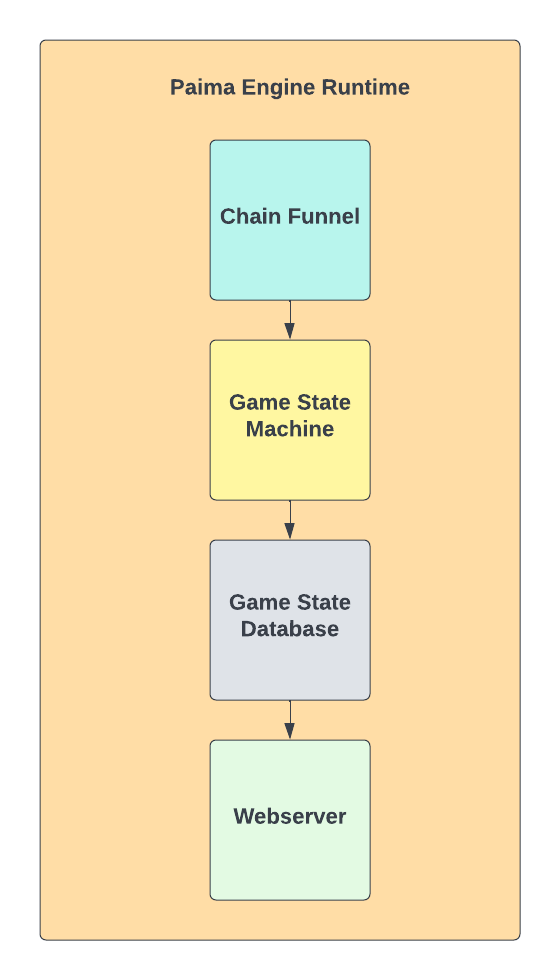

# Paima Engine Runtime

The goal of Paima Engine is to be a one-stop-shop for building the entire backend of decentralized blockchain games. In order to achieve this, we must unify all of the backend components in a way where they seamlessly click in place. To do this, Paima Engine will have a runtime which orchestrates everything together.



More palpably, the runtime's primary jobs are:

- Reading the latest processed block height from the database
- Polling the `chainFunnel` at a fixed rate to acquire a new `ChainData` for the following block height
- Supplying the `ChainData` to the `gameStateMachine`'s processing function
- Starting the webserver

## Runtime Interface

Initializing and starting the Paima Engine Runtime is quite simple:

```ts
// Intialize the runtime
let engine = paimaEngine.initialize(chainFunnel, gameStateMachine);

// Trigger starting the runtime
engine.run();
```

The runtime should also support the following extended interface which allows customizing functionality (prior to using the `.run()` endpoint):

```ts
// Add a GET endpoint to the baked-in webserver
engine.addGET('/open_lobbies', getOpenLobbies);

// Add a POST endpoint to the baked-in webserver
engine.addPOST('/test_post_endpoint', postEndpointLogic);

// Sets the polling rate of reading data from the blockchain via the `ChainFunnel` to every 5 seconds
engine.setPollingRate(5);

// And more endpoints which will be added over time which improve the experience (ie. logging)
```

## Runtime Startup

When `.run()` is called on the Paima Engine Runtime the following tasks take place before the runtime begins actively working:

- Verifying that the blockchain node provided in the `chainFunnel` is active/accessible
- Verifying that the database connection info provided in the `gameStateMachine` is valid and said database exists/can be connected to
- Starting the Webserver with all of the supplied GET and POST endpoints applied

If any of the above fail for any reason, then the runtime safely exits (closes the webserver if started, and anything else actively running on a different thread) and returns an error.

Runtime can also be started in a webserver only mode through provided `serverOnlyMode` attribute. This mode doesn't run the `Paima Funnel` & `SM`, only makes our `backend` endpoints accessible.
